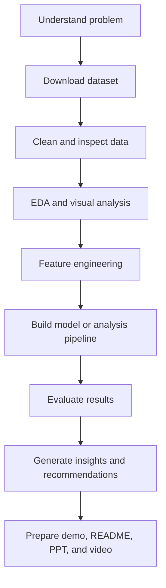
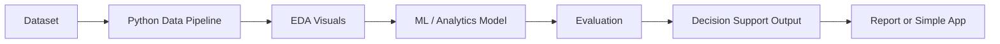

# Micro Insurance Claim Risk and Anomaly Detection System

## 1. Project Title
**Micro Insurance Claim Risk and Anomaly Detection System**

**[📄 View Presentation (PDF)](docs/presentation.pdf)** | **[🎥 Watch Demo Video](#)** *(Update this `#` with your actual video link)*

## 2. Problem Statement
Insurance teams cannot manually inspect every claim in detail. This system addresses this challenge by flagging suspicious or abnormal claims for human review. Given historical claim, policy, incident, and customer data, the system predicts the likelihood that a claim is fraudulent (`fraud_reported`), and turns that prediction into an actionable, explainable recommendation for a claims adjuster. It helps reduce operational risk while ensuring suspicious claims are reviewed responsibly.

## 3. Dataset/Reference Source
- **Dataset Name:** Insurance Fraud Detection
- **Link:** [https://www.kaggle.com/datasets/arpan129/insurance-fraud-detection](https://www.kaggle.com/datasets/arpan129/insurance-fraud-detection)
- **How to Use It:** We use claim, policy, incident, and customer fields from the `sample_or_raw_data.csv` to predict fraud reported risk.
- **Target / Output Field:** `fraud_reported` (Y/N) or anomaly score.

## 4. Tools Used
- **Python**: Core programming language.
- **Pandas, NumPy**: Data manipulation and feature engineering.
- **Matplotlib/Seaborn**: Exploratory Data Analysis (EDA) and visualizations.
- **Scikit-learn (and LightGBM)**: Training the Random Forest/LightGBM classification models, class imbalance handling, and evaluation.
- **Streamlit**: Building the interactive adjuster dashboard for the human-review workflow.

## 5. Project Workflow



**System / Pipeline Architecture**


## 6. AI/ML/Agent/Software Component
- **Fraud/Anomaly Classification**: We use an ML classification model (RandomForest/LightGBM) trained with class-imbalance-aware metrics to predict risk probabilities rather than just raw accuracy (since fraud is a rare event).
- **Reason-code generation**: We combine model feature-importance signals with domain business rules to explain *why* a claim looks risky.
- **Human-review workflow**: Instead of a "black box" automated denial, the system surfaces a risk score and reason codes (e.g. *"Claim amount is 50.9x the annual premium"*), empowering a human adjuster to make the final decision.

## 7. How to Run the Project

1. **Install dependencies**:
   ```bash
   pip install -r requirements.txt
   ```
2. **Run the Data Pipeline and Train the Model**:
   ```bash
   python src/main.py
   ```
   *This cleans the data, balances classes, trains the model, and saves artifacts to the `models/` directory.*
3. **Launch the Streamlit Dashboard**:
   ```bash
   streamlit run app/app.py
   ```
   *Open `http://localhost:8501` to view the UI. Select a policy number to view risk scores, reason codes, and log a decision.*

## 8. Demo Screenshots
See the `docs/screenshots/` folder for screenshots of the generated evaluations (Feature Importance, ROC Curve, Confusion Matrix, and Risk Score Distribution).

### Streamlit Dashboard
*(Note: Ensure your UI screenshot is named `streamlit_dashboard.png` and placed in the `docs/screenshots/` folder, or update the filename below).*


## 9. Results and Insights
- **Precision (Fraud class)**: ~0.62
- **Recall (Fraud class)**: ~0.84
- **F1-score (Fraud class)**: ~0.71
- **ROC-AUC**: ~0.84
- **Insights**: The model is heavily tuned for high recall to ensure few fraudulent claims slip through. The human adjuster then acts as a filter on the flagged claims to manage precision.

## 10. Limitations
- **Data Size**: The system is trained on a small historical sample. Real-world deployments need continuous retraining on a much larger, regularly refreshed claim book.
- **Not Definitive Proof**: Reason codes are decision-support signals, not proof of fraud. Legitimate claims will sometimes share surface-level traits with fraudulent ones.
- **Historical Bias**: The model can reflect historical biases in how past claims were labeled; scores should never be the sole basis for denying a claim.
- **Network Fraud**: No real-time fraud ring/network detection (e.g., shared addresses) is included in this version.

## 11. Future Improvements
- Add network/graph-based anomaly detection across claims sharing garages, addresses, or witnesses.
- Track model drift and periodically retrain as new adjuster decisions accumulate in `data/review_log.csv`.
- Expose an API endpoint (FastAPI) so the scoring logic can be called directly from internal claims-management systems.
- Add fairness audits (e.g., demographic parity checks) before production rollout.

## 12. Team Members
- Shaurya Kakkar
- Souryaneel Pal
- Aryan
- Utkarsh Pandey
- Shambhav Shuckla

---

### Repository Structure

```text
micro_insurance_claim_risk_and_anomaly_detection_system/
│
├── data/
│   ├── sample_or_raw_data.csv   # Source dataset
│   └── review_log.csv           # Runtime log of adjuster decisions
│
├── notebooks/
│   └── exploration_or_modeling.ipynb
│
├── src/
│   ├── main.py                  # Model training and pipeline execution (Entry point)
│   ├── preprocessing.py         # Cleaning, encoding, scaling, and balancing
│   ├── explainability.py        # Reason-code generation (business rules)
│   └── utils.py                 # Shared helpers
│
├── app/
│   └── app.py                   # Streamlit adjuster dashboard
│
├── docs/
│   ├── project_report.md
│   ├── presentation.pdf         # Demo presentation
│   └── screenshots/             # Evaluation plots and UI images
│
├── models/                      # Generated after running main.py
│   ├── preprocessor.pkl
│   ├── fraud_model.pkl
│   ├── model_metadata.json
│   └── scored_test_set.csv
│
├── requirements.txt
└── README.md
```
