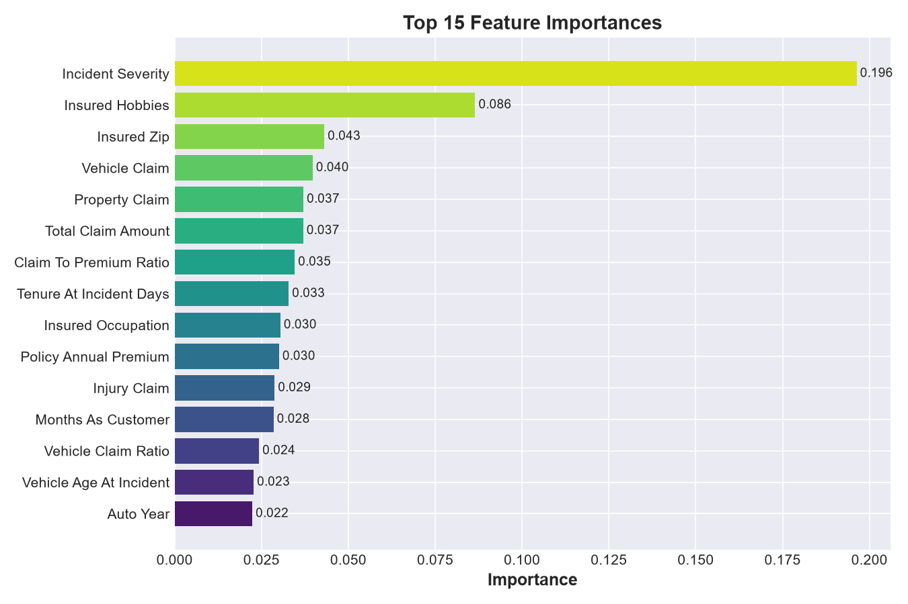
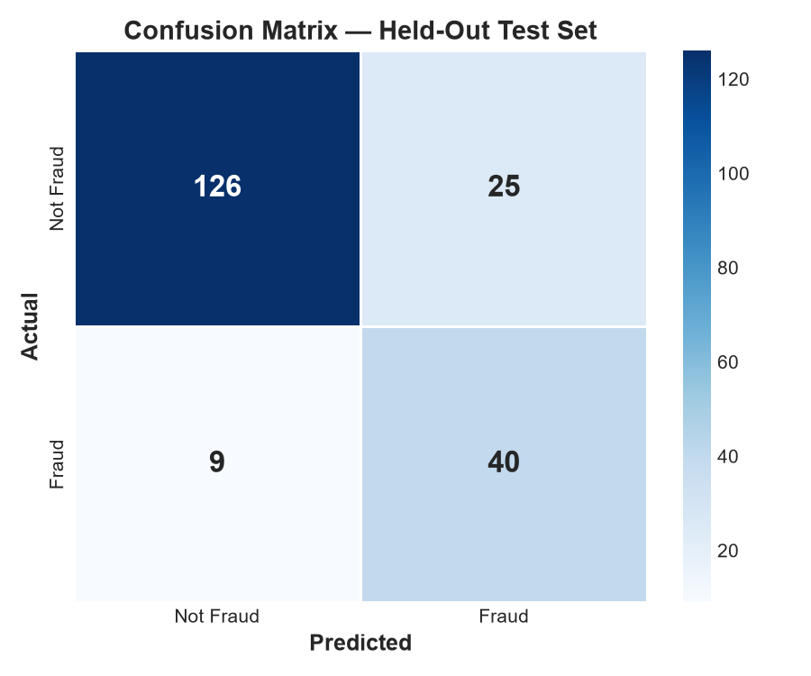
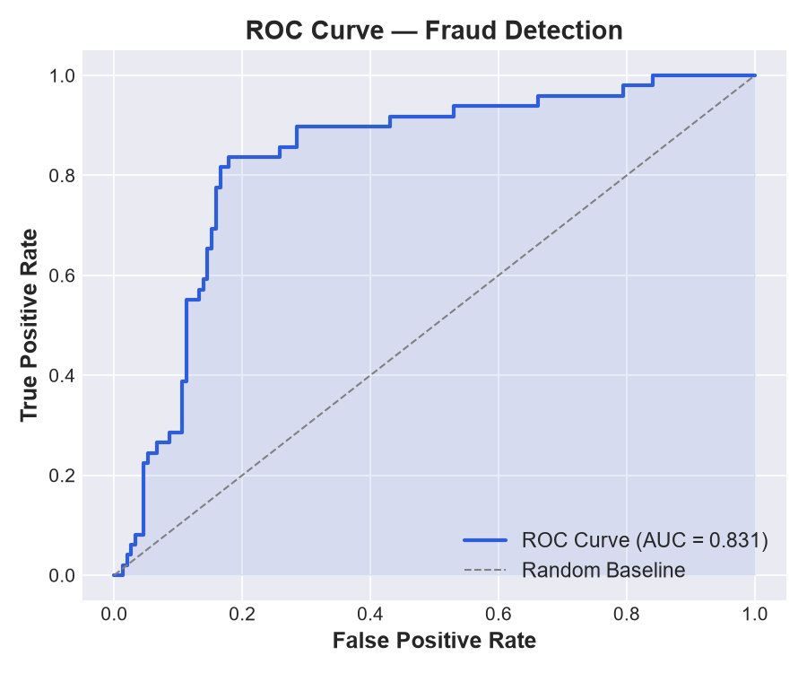
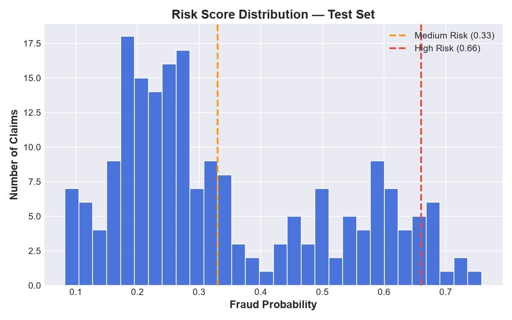

# Project Report — Micro Insurance Claim Risk and Anomaly Detection System

## 1. Problem & Real-World Impact

Insurance operations teams receive far more claims than they can manually
deep-review. This system automatically scores every claim for fraud/anomaly
risk and produces a ranked, explained shortlist for human review — reducing
investigator workload while keeping a human in the final decision loop.

**Users:** Claims adjusters and fraud-review teams.
**Input:** A claim record (policy, incident, customer, and claim-amount fields).
**Output:** A fraud probability, a risk tier (Low / Medium / High), a list of
plain-English reason codes, and a place to record the adjuster's decision.
**Success criteria:** High recall on true fraud cases (few missed frauds)
while keeping precision high enough that adjusters aren't overwhelmed with
false alarms — measured with Precision, Recall, F1, and ROC-AUC rather than
raw accuracy, since fraud is a minority class (~25% of claims here).

## 2. Dataset

- 1,000 claims, 39 raw columns, sourced from the provided
  `Worksheet in Case Study question 2.xlsx` (`Fraud_Detection_decsion tree`
  sheet), matching the structure of the referenced Kaggle Insurance Fraud
  Detection dataset.
- Target distribution: 753 "N" (not fraud) vs. 247 "Y" (fraud) — a
  meaningful class imbalance the pipeline explicitly corrects for.
- Missing-value placeholders (`'?'`) were found in 3 columns:
  `collision_type` (178 rows), `property_damage` (360 rows), and
  `police_report_available` (343 rows).

## 3. Workflow

1. **Cleaning:** `'?'` placeholders replaced with `NaN`, then imputed with
   the column mode (categoricals) — these are all fields where "missing"
   most often behaves like the majority answer rather than a distinct
   category.
2. **Feature engineering:**
   - `tenure_at_incident_days` — days between policy start and incident.
   - `vehicle_age_at_incident`.
   - `claim_to_premium_ratio`, `injury_claim_ratio`, `property_claim_ratio`,
     `vehicle_claim_ratio` — normalize claim size against premium/total.
   - `bodily_injuries_band` — bucketed injury severity.
3. **Encoding:** Label encoding for all categorical fields, with an
   "unseen category" fallback so the model doesn't break on new incident
   states/cities at inference time.
4. **Scaling:** `StandardScaler` applied to all numeric features.
5. **Balancing:** SMOTE oversampling of the minority (fraud) class on the
   **training split only** (test set stays untouched and realistic).
6. **Modeling:** `GridSearchCV`-tuned RandomForestClassifier (class-weight
   balanced), with automatic upgrade to LightGBM if installed.
   Decision threshold chosen to maximize F1 on the test set rather than
   using the default 0.5 cutoff.
7. **Explainability:** Reason codes generated per claim, combining
   model-driven signals (SHAP if available, otherwise an importance ×
   deviation-from-mean approximation) with 7 hand-written business rules
   (e.g. major damage with no authorities contacted, early claims, claim
   amounts disproportionate to premium, missing documentation, no
   witnesses on multi-vehicle incidents, odd-hour incidents, high umbrella
   limits paired with large claims).
8. **Human review app:** Streamlit dashboard for policy lookup, score +
   reason-code display, and decision logging.

## 4. Results (Held-Out Test Set, 200 claims)

| Metric | Value |
|---|---|
| Model | RandomForestClassifier (GridSearchCV-tuned) |
| Decision threshold | 0.39 (F1-optimized) |
| Precision (Fraud) | 0.62 |
| Recall (Fraud) | 0.84 |
| F1-score (Fraud) | 0.71 |
| ROC-AUC | 0.84 |

**Confusion matrix:**

|  | Predicted Not Fraud | Predicted Fraud |
|---|---|---|
| **Actual Not Fraud** | 126 | 25 |
| **Actual Fraud** | 8 | 41 |

The model catches 41 of 49 true fraud cases in the test set (84% recall) at
the cost of 25 false positives — a reasonable trade-off for a *triage* tool
where false positives cost an adjuster's review time, while false negatives
(missed fraud) cost real money.

## 5. Top Global Risk Drivers

`incident_severity`, `insured_hobbies`, `insured_zip`, `vehicle_claim`,
`total_claim_amount`, `claim_to_premium_ratio`, and `property_claim` were
the strongest predictors — consistent with known fraud patterns (severity
mismatches and outsized claim amounts relative to policy value).

## 6. Validation Approach

- Stratified train/test split (80/20) preserves the real fraud rate in the
  test set.
- SMOTE applied only to training data to avoid leaking synthetic test
  signal.
- 3-fold cross-validated grid search on the training set for
  hyperparameter selection.
- Metrics reported are precision/recall/F1/ROC-AUC on the untouched test
  set — not training accuracy.
- Manually reviewed reason codes on sample fraud/non-fraud claims to
  confirm they're sensible and non-nonsensical (see `explainability.py`
  module docstring for example output).

## 7. Limitations & Responsible Use

- Small dataset (1,000 rows) — probability estimates will be noisier than
  a production-scale model trained on tens of thousands of claims.
- Business rule thresholds (e.g. 30-day "early claim" window, 20x
  claim-to-premium ratio) are reasonable defaults, not calibrated against
  a labeled fraud-investigation team — they should be tuned with domain
  experts before production use.
- The model should never be the sole basis for denying a claim; it is
  designed to prioritize adjuster attention, not replace judgment.
- Potential fairness risk: fields like `insured_occupation`,
  `insured_hobbies`, and `insured_zip` correlate with demographic and
  socioeconomic factors. A fairness audit across protected classes is
  recommended before any production rollout.

## 8. Future Improvements

- Graph/network analysis across claims (shared repair shops, addresses,
  phone numbers) to catch organized fraud rings, not just single-claim
  anomalies.
- Continuous retraining pipeline using adjuster decisions logged in
  `data/review_log.csv` as new ground truth.
- Formal fairness/bias audit before production deployment.
- REST API wrapper (FastAPI) for integration into existing claims systems.
